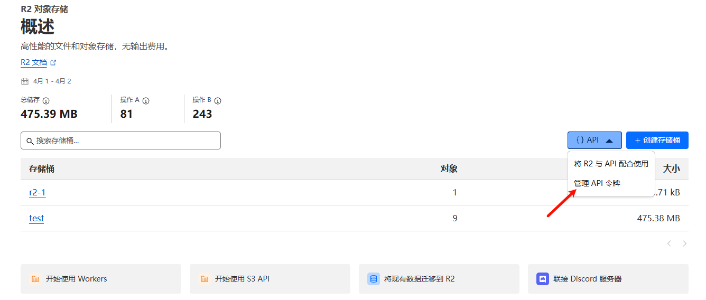
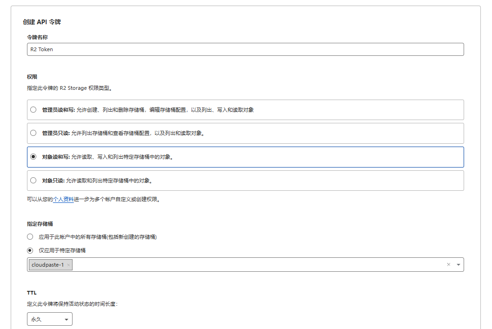
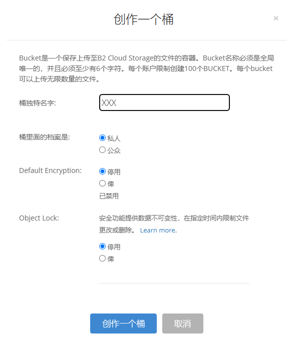
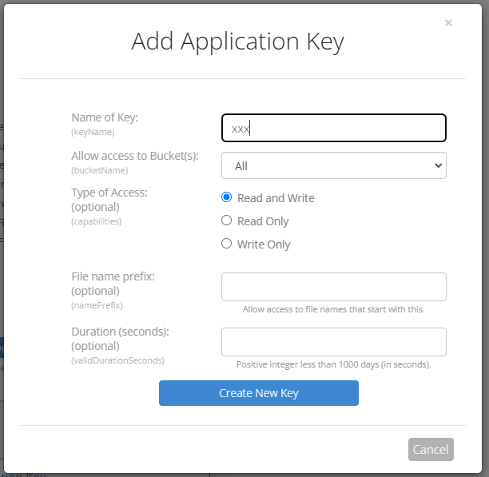
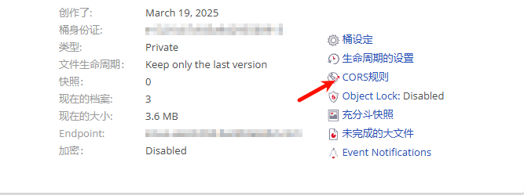
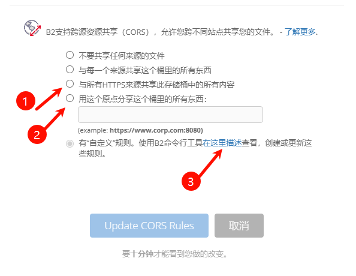

# CloudPaste - Online Clipboard 📋

<div align="center">
    <p>
    <a href="README.md">中文</a> | <a href="README_EN.md">English</a>
    </p>
    
    <h3>Cloudflare-based online clipboard and file sharing service with Markdown editing and file upload support</h3>
</div>

<p align="center">
  <a href="#-showcase">📸 Showcase</a> •
  <a href="#-features">✨ Features</a> •
  <a href="#-deployment-guide">🚀 Deployment Guide</a> •
  <a href="#-tech-stack">🔧 Tech Stack</a> •
  <a href="#-development">💻 Development</a> •
  <a href="#-license">📄 License</a>
</p>

## 📸 Showcase

<table align="center">
  <tr>
    <td></td>
    <td></td>
  </tr>
  <tr>
    <td></td>
    <td></td>
  </tr>
  <tr>
    <td></td>
    <td></td>
  </tr>
</table>

## ✨ Features

### 📝 Markdown Editing and Sharing

- **Powerful Editor**: Integrated with [Vditor](https://github.com/Vanessa219/vditor), supporting GitHub-flavored Markdown, math formulas, flowcharts, mind maps, and more
- **Secure Sharing**: Content can be protected with access passwords
- **Flexible Expiration**: Support for setting content expiration times
- **Access Control**: Ability to limit maximum view count
- **Customization**: Personalized share links and notes
- **Multi-format Export**: Support for PDF, Markdown, and HTML export
- **Easy Sharing**: One-click link copying and QR code generation
- **Auto-save**: Support for automatic draft saving

### 📤 File Upload and Management

- **Multiple Storage Support**: Compatible with various S3 storage services (Cloudflare R2, Backblaze B2, AWS S3, etc.)
- **Storage Configuration**: Visual interface for configuring multiple storage spaces, flexible switching of default storage sources
- **Efficient Upload**: Direct upload to S3 storage via presigned URLs
- **Real-time Feedback**: Real-time upload progress display
- **Custom Limits**: Single upload limits and maximum capacity restrictions
- **Metadata Management**: File notes, passwords, expiration times, access restrictions
- **Data Analysis**: File access statistics and trend analysis

### 🛠 Convenient File/Text Operations

- **Unified Management**: Support for file/text creation, deletion, and property modification
- **Online Preview**: Online preview and direct link generation for common documents, images, and media files
- **Sharing Tools**: Generation of short links and QR codes for cross-platform sharing
- **Batch Management**: Batch operations and display for files/text

### 🔐 Lightweight Permission Management

#### Administrator Permission Control

- **System Management**: Global system settings configuration
- **Content Moderation**: Management of all user content
- **Storage Management**: Addition, editing, and deletion of S3 storage services
- **Permission Assignment**: Creation and permission management of API keys
- **Data Analysis**: Complete access to statistical data

#### API Key Permission Control

- **Text Permissions**: Create/edit/delete text content
- **File Permissions**: Upload/manage/delete files
- **Storage Permissions**: Ability to select specific storage configurations
- **Read/Write Separation**: Can set read-only or read-write permissions
- **Time Control**: Custom validity period (from hours to months)
- **Security Mechanism**: Automatic expiration and manual revocation functions

### 💫 System Features

- **High Adaptability**: Responsive design, adapting to mobile devices and desktops
- **Multilingual**: Chinese/English bilingual interface support
- **Visual Modes**: Bright/dark theme switching
- **Secure Authentication**: JWT-based administrator authentication system
- **Offline Experience**: PWA support, allowing offline use and desktop installation

## 🚀 Deployment Guide

### Prerequisites

Before starting deployment, please ensure you have prepared the following:

- [ ] [Cloudflare](https://dash.cloudflare.com) account (required)
- [ ] If using R2: Activate **Cloudflare R2** service and create a bucket (requires payment method)
- [ ] If using Vercel: Register for a [Vercel](https://vercel.com) account
- [ ] Configuration information for other S3 storage services:
  - `S3_ACCESS_KEY_ID`
  - `S3_SECRET_ACCESS_KEY`
  - `S3_BUCKET_NAME`
  - `S3_ENDPOINT`

<details>
<summary><b>👉 View Complete Deployment Guide</b></summary>

### 📑 Table of Contents

- [Action Automated Deployment](#Action-Automated-Deployment)
  - [Backend Automated Deployment](#Backend-Automated-Deployment)
  - [Frontend Automated Deployment](#Frontend-Automated-Deployment)
- [Manual Deployment](#Manual-Deployment)
  - [Backend Manual Deployment](#Backend-Manual-Deployment)
  - [Frontend Manual Deployment](#Frontend-Manual-Deployment)

---

## Action Automated Deployment

Using GitHub Actions enables automatic deployment of the application after code is pushed.

### Configure GitHub Repository

1. Fork or clone the repository [https://github.com/ling-drag0n/CloudPaste](https://github.com/ling-drag0n/CloudPaste)
2. Go to your GitHub repository settings
3. Navigate to Settings → Secrets and variables → Actions → New Repository secrets
4. Add the following Secrets:

| Secret Name             | Required | Purpose                                                                                  |
| ----------------------- | -------- | ---------------------------------------------------------------------------------------- |
| `CLOUDFLARE_API_TOKEN`  | ✅       | Cloudflare API token (requires Workers, D1, and Pages permissions)                       |
| `CLOUDFLARE_ACCOUNT_ID` | ✅       | Cloudflare account ID                                                                    |
| `ENCRYPTION_SECRET`     | ❌       | Key for encrypting sensitive data (if not provided, one will be automatically generated) |

#### Obtain Cloudflare API Token

1. Visit [Cloudflare Dashboard](https://dash.cloudflare.com/profile/api-tokens)
2. Create a new API token
3. Select the "Edit Cloudflare Workers" template, and add D1 database edit permission

### Backend Automated Deployment

Fork the repository, fill in the secrets, and then run the workflow.
Deployment is automatically triggered whenever files in the `backend` directory are changed and pushed to the `main` or `master` branch. The workflow proceeds as follows:

1. Checkout code repository
2. Set up Node.js environment
3. Install dependencies
4. Disable Wrangler telemetry data collection
5. **Automatically create D1 database** (if it doesn't exist)
6. **Initialize database with schema.sql** (create tables and initial data)
7. **Set ENCRYPTION_SECRET environment variable** (obtained from GitHub Secrets or automatically generated)
8. Automatically deploy Worker to Cloudflare
9. Set up a custom domain to replace the original cf domain

### Frontend Automated Deployment

#### Cloudflare Pages（Recommendation）

Fork the repository, fill in the secrets, and then run the workflow.
Deployment is automatically triggered whenever files in the `frontend` directory are changed and pushed to the `main` or `master` branch. After deployment, you need to set environment variables in the Cloudflare Pages control panel:

1. Log in to [Cloudflare Dashboard](https://dash.cloudflare.com/)
2. Navigate to Pages → Your project (e.g., "cloudpaste-frontend")
3. Click "Settings" → "Environment variables"
4. Add environment variable:

   - Name: `VITE_BACKEND_URL`
   - Value: Your backend Worker URL (e.g., `https://cloudpaste-backend.your-username.workers.dev`)It is recommended to use a custom worker backend domain.

5. Then run the workflow again to complete the backend domain loading

#### Vercel

For Vercel, it's recommended to deploy as follows:

1. Import your GitHub project after forking
2. Configure deployment parameters:

```
Framework Preset: Vite
Build Command: npm run build
Output Directory: dist
Install Command: npm install
```
3. Configure the environment variables below: Enter: VITE_BACKEND_URL and your backend domain
4. Click the "Deploy" button to deploy

☝️ **Choose one of the above methods**

---

## Manual Deployment

### Backend Manual Deployment

1. Clone the repository

```bash
git clone https://github.com/ling-drag0n/CloudPaste.git
cd CloudPaste/backend
```

2. Install dependencies

   ```bash
   npm install
   ```

3. Log in to Cloudflare

   ```bash
   npx wrangler login
   ```

4. Create D1 database

   ```bash
   npx wrangler d1 create cloudpaste-db
   ```

   Note the database ID from the output.

5. Modify wrangler.toml configuration

   ```toml
   [[d1_databases]]
   binding = "DB"
   database_name = "cloudpaste-db"
   database_id = "YOUR_DATABASE_ID"
   ```

6. Deploy Worker

   ```bash
   npx wrangler deploy
   ```

   Note the URL from the output; this is your backend API address.

7. Initialize database (automatic)
   Visit your Worker URL to trigger initialization:

   ```
   https://cloudpaste-backend.your-username.workers.dev
   ```

   ⚠️ **Security Tip**: Please change the default administrator password immediately after system initialization (Username: admin, Password: admin123).

### Frontend Manual Deployment

#### Cloudflare Pages

1. Prepare frontend code

   ```bash
   cd CloudPaste/frontend
   npm install
   ```

2. Configure environment variables
   Create or modify the `.env.production` file:

   ```
   VITE_BACKEND_URL=https://cloudpaste-backend.your-username.workers.dev
   VITE_APP_ENV=production
   VITE_ENABLE_DEVTOOLS=false
   ```

3. Build frontend project

   ```bash
   npm run build
   ```

4. Deploy to Cloudflare Pages

   **Method 1**: Via Wrangler CLI

   ```bash
   npx wrangler pages deploy dist --project-name=cloudpaste-frontend
   ```

   **Method 2**: Via Cloudflare Dashboard

   1. Log in to [Cloudflare Dashboard](https://dash.cloudflare.com/)
   2. Select "Pages"
   3. Click "Create a project" → "Direct Upload"
   4. Upload files from the `dist` directory
   5. Set project name (e.g., "cloudpaste-frontend")
   6. Click "Save and Deploy"

#### Vercel

1. Prepare frontend code

   ```bash
   cd CloudPaste/frontend
   npm install
   ```

2. Install and log in to Vercel CLI

   ```bash
   npm install -g vercel
   vercel login
   ```

3. Configure environment variables, same as for Cloudflare Pages
4. Build and deploy

   ```bash
   vercel --prod
   ```

   Follow the prompts to configure the project.

</details>

<details>
<summary><b>👉 S3 Cross-Origin Configuration Guide</b></summary>

## R2 API Retrieval and Cross-Origin Configuration

1. Log in to Cloudflare Dashboard
2. Click R2 Storage and create a bucket.
3. Create API token

   
   


4. Save all data after creation; you'll need it later
5. Configure cross-origin rules: click the corresponding bucket, click Settings, edit CORS policy as shown below:

```json
[
  {
    "AllowedOrigins": ["http://localhost:3000", "https://replace-with-your-frontend-domain"],
    "AllowedMethods": ["GET", "PUT", "POST", "DELETE", "HEAD"],
    "AllowedHeaders": ["*"],
    "ExposeHeaders": ["ETag"],
    "MaxAgeSeconds": 3600
  }
]
```

## B2 API Retrieval and Cross-Origin Configuration

1. If you don't have a B2 account, [register](https://www.backblaze.com/sign-up/cloud-storage?referrer=getstarted) one first, then create a bucket.
   
2. Click Application Key in the sidebar, click Create Key, and follow the illustration.
   
3. Configure B2 cross-origin; B2 cross-origin configuration is more complex, take note
   
4. You can try options 1 or 2 first, go to the upload page and see if you can upload. If F12 console shows cross-origin errors, use option 3. For a permanent solution, use option 3 directly.
   

Regarding option 3 configuration, since the panel cannot configure it, you need to configure manually by [downloading B2 CLI](https://www.backblaze.com/docs/cloud-storage-command-line-tools) tool.
After downloading, in the corresponding download directory CMD, enter the following commands:

```txt
b2.exe account authorize   //Log in to your account, following prompts to enter your keyID and applicationKey
b2.exe bucket get <bucketName> //You can execute to get bucket information, replace <bucketName> with your bucket name
```

Since I'm configuring on Windows, I input in CMD in the corresponding CLI's exe folder; Python CLI would be similar:

```cmd
b2.exe bucket update <bucketName> allPrivate --cors-rules "[{\"corsRuleName\":\"CloudPaste\",\"allowedOrigins\":[\"*\"],\"allowedHeaders\":[\"*\"],\"allowedOperations\":[\"b2_upload_file\",\"b2_download_file_by_name\",\"b2_download_file_by_id\",\"s3_head\",\"s3_get\",\"s3_put\",\"s3_post\",\"s3_delete\"],\"exposeHeaders\":[\"Etag\",\"content-length\",\"content-type\",\"x-bz-content-sha1\"],\"maxAgeSeconds\":3600}]"
```

Replace <bucketName> with your bucket name. For allowedOrigins in the cross-origin allowance, you can configure based on your needs; here it allows all. 

5. Cross-origin configuration complete

## More S3-related configurations to come......

</details>

## 🔧 Tech Stack

### Frontend

- **Framework**: Vue.js 3 + Vite
- **Styling**: TailwindCSS
- **Editor**: Vditor
- **Internationalization**: Vue-i18n
- **Charts**: Chart.js + Vue-chartjs

### Backend

- **Runtime**: Cloudflare Workers
- **Framework**: Hono
- **Database**: Cloudflare D1 (SQLite)
- **Storage**: Multiple S3-compatible services (supports R2, B2, AWS S3)
- **Authentication**: JWT tokens + API keys

## 💻 Development

### API Documentation

[API Documentation](Api-doc.md)

### Local Development Setup

1. **Clone project repository**

   ```bash
   git clone https://github.com/ling-drag0n/cloudpaste.git
   cd cloudpaste
   ```

2. **Backend setup**

   ```bash
   cd backend
   npm install
   # Initialize D1 database
   wrangler d1 create cloudpaste-db
   wrangler d1 execute cloudpaste-db --file=./schema.sql
   ```

3. **Frontend setup**

   ```bash
   cd frontend
   npm install
   ```

4. **Configure environment variables**

   - In the `backend` directory, create a `wrangler.toml` file to set development environment variables
   - In the `frontend` directory, configure the `.env.development` file to set frontend environment variables

5. **Start development servers**

   ```bash
   # Backend
   cd backend
   npm run dev

   # Frontend (in another terminal)
   cd frontend
   npm run dev
   ```

### Project Structure

```
CloudPaste/
├── frontend/                # Frontend Vue.js application
│   ├── src/                 # Source code
│   │   ├── components/      # Vue components
│   │   ├── api/             # API clients and services
│   │   ├── i18n/            # Internationalization resource files
│   │   ├── utils/           # Utility functions
│   │   └── assets/          # Static assets
│   └── ...
└── backend/                 # Cloudflare Workers backend
    ├── worker.js            # Main Worker file
    ├── schema.sql           # D1 database schema
    └── ...
```

## 📄 License

Apache License 2.0

This project is licensed under the Apache License 2.0 - see the [LICENSE](LICENSE) file for details.

**Key points of this license for this project:**

- You are free to use, modify, and distribute this software
- You can use this software for commercial purposes
- You must retain the original copyright notice and attribution
- No warranty is provided, and the author is not liable for any damages

## Star History

[](https://star-history.com/#ling-drag0n/CloudPaste&Date)

**If you think the project is good I hope you can give a free star✨✨, Thank you very much!**
